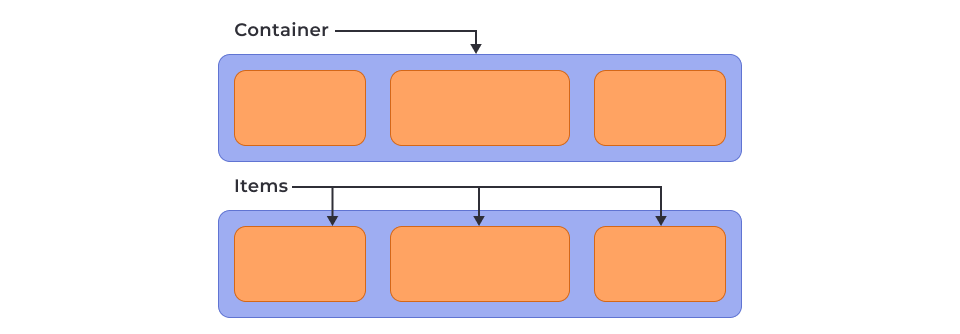
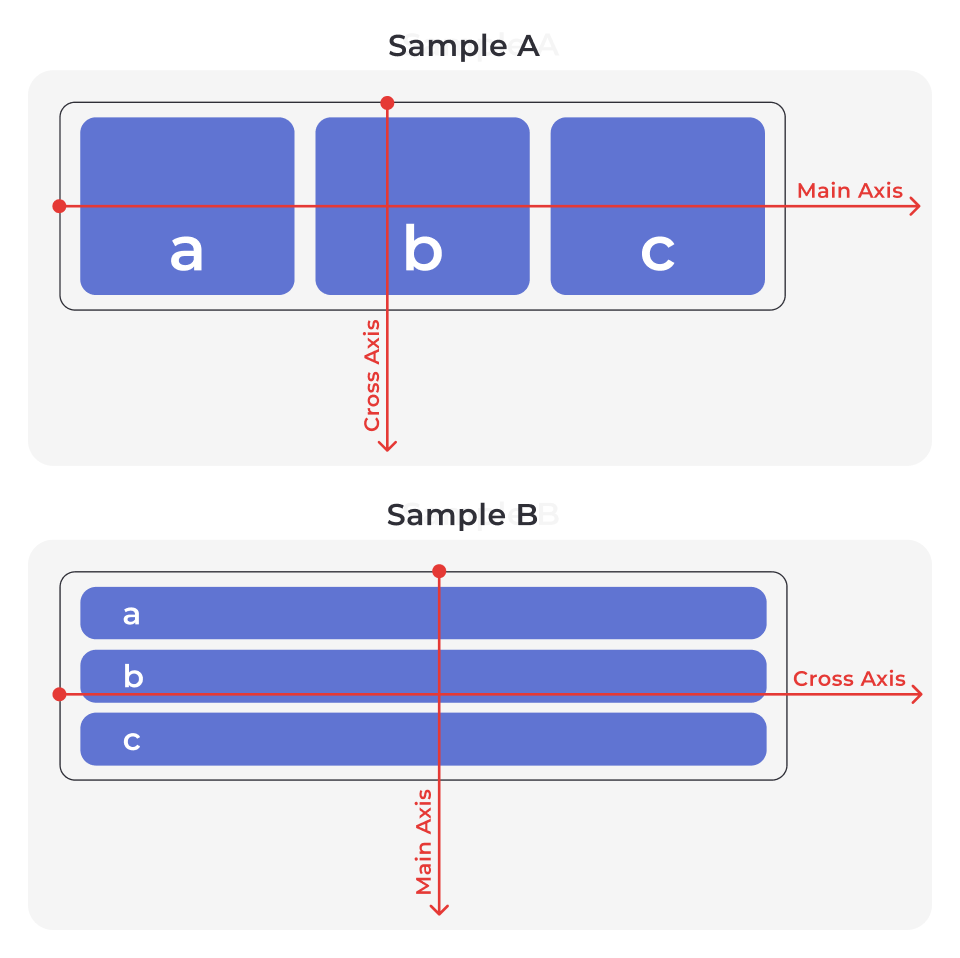
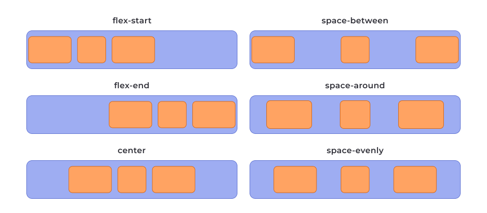
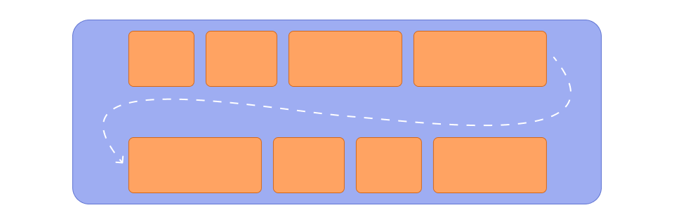
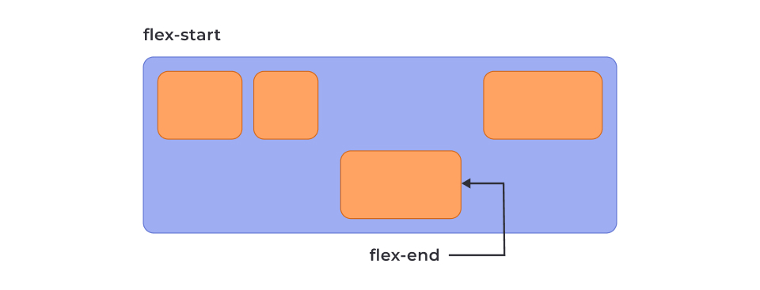
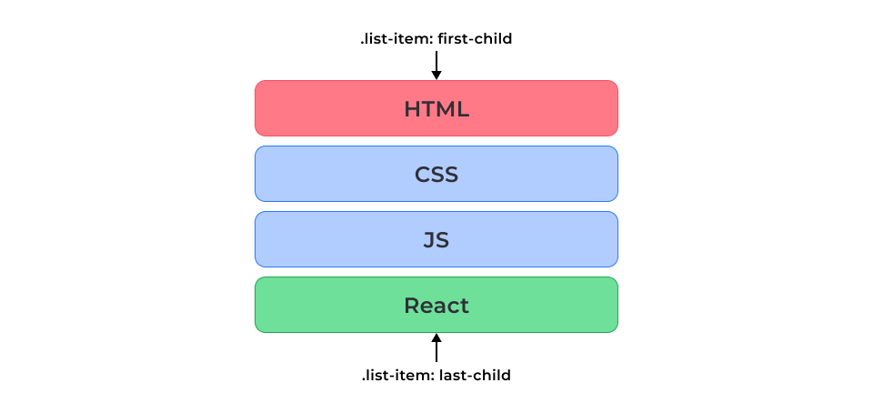
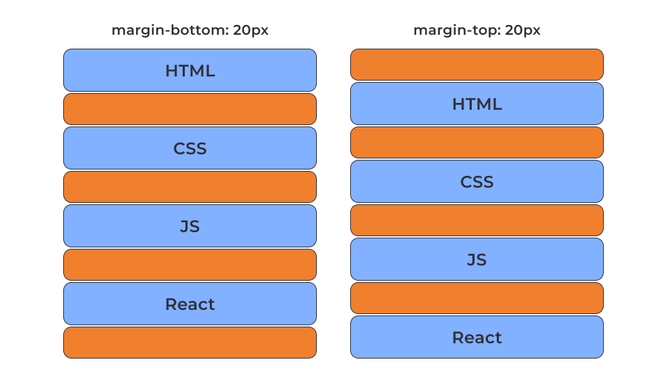
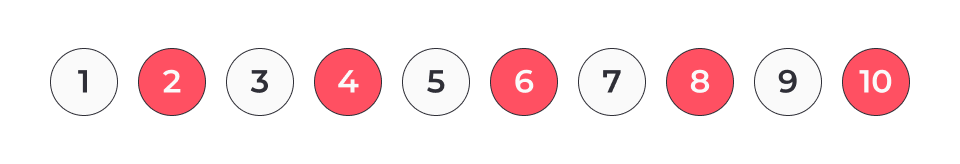
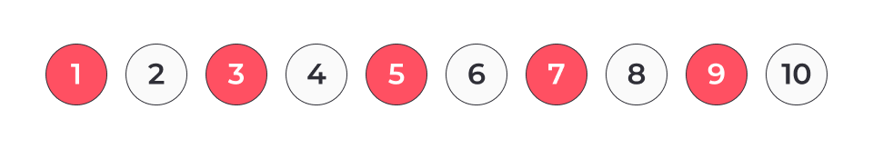

# Flex cheatsheet

Flexible Box Layout (Flexbox)



## Container

Main axis, Cross axis



main-start, main-end, cross-start, cross-end


### display

```css
display: flex | inline-flex
```

### gap

проміжок між flex-елементами

``` css
gap: 8px;
row-gap: 8px;
column-gap: 8px;
```

### flex-direction

Властивість `flex-direction` задає напрямок головної осі, а отже визначає напрямок елементів у контейнері.

```css
flex-direction: row | row-reverse | column | column-reverse
```


### justify-content

Властивість `justify-content` керує позиціонуванням елементів на головній осі, від `main-start` до `main-end`.

```css
justify-content: flex-start | flex-end | center | space-between | space-around | space-evenly
```



### align-items

Властивість `align-items` керує розташуванням елементів вздовж поперечної осі `cross axis`. Це аналог `justify-content` тільки для іншої осі.

```css
align-items: stretch | flex-start | flex-end | center | baseline
```


### flex-wrap

Властивість `flex-wrap` дозволяє перетворити однорядковий контейнер на багаторядковий.

```css
flex-wrap: nowrap | wrap | wrap-reverse
```



```css
.item {
  width: calc((100% - 2*10px) / 3);
}

/* 100% - кількість_проміжків_у_рядку * значення_одного_проміжку) / кількість_елементів_у_рядку */
```

### align-content

Керує вирівнюванням усіх рядків багаторядкового контейнера уздовж `cross axis`, якщо є вільне місце. Аналогічно тому, як `align-items` вирівнює елементи в кожному рядку. Ця властивість не діє, коли є лише один рядок елементів або в контейнері немає вільного місця за вертикаллю (явно не задана висота більше, ніж контент).

```css
align-content: flex-start | flex-end | center | space-between | space-around | space-evenly | stretch
```


## Flex-items


### flex-basis

Властивість `flex-basis` визначає початковий розмір flex-елемента у flex-контейнері.
Початковий розмір — це розмір до застосування властивостей `flex-grow` і `flex-shrink`, які також впливатимуть на розмір елементів відносно один одного.

```css
flex-basis: auto | значення
```

Якщо застосовано обидві властивості, `flex-basis` і `width`, то властивість `width` ігнорується.
Властивість `flex-basis` може визначати висоту, а не ширину елемента. Це відбувається, коли напрямок головної осі вертикальний.
Властивості `min-width` і `max-width` працюють, як обмежувачі розміру елемента, навіть якщо у нього вказано `flex-basis`.
Властивість `flex-basis` — це не фінальний розмір елемента, а розмір до розподілу вільного простору, який регулюється властивостями `flex-grow` і `flex-shrink`.

### flex-grow

Властивість `flex-grow` — визначає здатність елемента займати більше місця (рости), ніж початковий розмір. Значення визначається як пропорція (частка) вільного місця в контейнері.

```css
flex-grow: частка
```


[Example (flex-grow.html)](03_flexbox/flex-grow.html)

### flex-shrink

На противагу властивості `flex-grow`, `flex-shrink` визначає здатність flex-елемента займати менше місця (стискатися), ніж його початковий розмір, тобто впливає на фінальний розмір елемента.

```css
flex-shrink: значення;
```


[Example (flex-shrink.html)](03_flexbox/flex-shrink.html)

### align-self

Властивість `align-self` дозволяє елементу змінити своє розташування на cross axis, перевизначивши собі значення властивості `align-items` від контейнера.

```css
align-self: auto | flex-start | flex-end | center | baseline | stretch
```



[Example (align-self.html)](03_flexbox/align-self.html)

### order

Використовуючи властивість order можна візуально змінити порядок розташування елементів уздовж main axis. При цьому в HTML-коді нічого не зміниться. За замовчуванням всі елементи мають значення 0.

```css
order: позиція;
```


## Pseudo-classes

### :first-child і :last-child



Problem



```css
/* solution 1 */

.list-item {
  margin-bottom: 12px;
}

.list-item:last-child {
  margin-bottom: 0;
}
```

### :not()

Псевдоклас `:not()` дозволяє вибрати всі елементи, що не підходять під критерій.

Критерій вказується у вигляді простого селектора, записаного в дужках. Простий селектор — це універсальний селектор, селектор типу, ідентифікатора, атрибута, класу чи псевдокласу.

```css
:not(selector)
```

```css
/* solution 2 */

.list-item:not(:last-child) {
  margin-bottom: 20px;
}
```

### :nth-child(an + b)

Псевдоклас `:nth-child(an + b)` вибирає елементи в колекції сусідів за номером, вказаним у дужках, за допомогою циклу `an + b`, який дозволяє задати правило для послідовності елементів.

```html
<ul class="list">
  <li class="list-item">1</li>
  <li class="list-item">2</li>
  <li class="list-item">3</li>
  <li class="list-item">4</li>
  <li class="list-item">5</li>
  <li class="list-item">6</li>
  <li class="list-item">7</li>
  <li class="list-item">8</li>
  <li class="list-item">9</li>
  <li class="list-item">10</li>
</ul>
```

```css
.list-item:nth-child(2n) {
  background-color: orange;
}

/* Аналогічно використовуючи псевдонім */
.list-item:nth-child(even) {
  background-color: orange;
}
```



```css
.list-item:nth-child(2n + 1) {
  background-color: orange;
}

/* Аналогічно використовуючи псевдонім */
.list-item:nth-child(odd) {
  background-color: orange;
}
```




