# Decorations and animations

**Контентні зображення** несуть смислове навантаження, відносяться до вмісту сторінки та допомагають донести до користувача корисну інформацію. Вони додаються в HTML-розмітці за допомогою тегу `` з обов'язково заповненим атрибутом `alt`, що описує зображення.

**Декоративні зображення** використовуються для додаткового оформлення. Вони не несуть корисної інформації та є елементами дизайну. Додаються через `CSS` як фон елементу або, у випадку векторної графіки, розмічаються в HTML тегом `<svg>`.

**Фон** — це не тільки декоративний ефект для оформлення, але й допомога у сприйнятті ідеї, підказка про вміст елемента. Наприклад, зелений колір асоціюється з успішною операцією, а червоний - з помилкою. Фонове зображення також допомагає передати вміст або додати оформлення.

## Background

[Background example](background.html)

### background-image

```css
background-image: url(шлях до зображення);
background-color: #2a2a2a;
```

### background-repeat

```css
background-repeat: repeat | repeat-x | repeat-y | no-repeat
```

### background-position

```css
background-position: x y;
```

```css
/* Поставить фонове зображення по центру */
background-position: 50% 50%;

/* Поставить фонове зображення 100px від лівого краю та 200px від верху */
background-position: 100px 200px;

/* Поставить фонове зображення у нижній правий кут */
background-position: right bottom;

/* Поставить фонове зображення у верхній лівий кут */
background-position: left top;
```

Налаштування позиції зі зміщенням

```css
backrgound-position: x зміщення-x y зміщення-y
```

Наприклад, якщо необхідно розташувати фон у нижньому правому куті елемента довільних розмірів таким чином, щоб фон відставав від меж на 30px справа і 20px знизу.

```css
backrgound-position: right 30px bottom 20px;
```

### background-size

```css
background-size: auto | значення | cover | contain
```

```css
/* Вихідні розміри зображення, значення за замовчуванням */
background-size: auto auto;

/* Ширина 200px, висота буде пропорційна */
background-size: 200px;

/* Ширина 200px, висота 300px */
background-size: 200px 300px;
```

- cover — за рахунок обрізання зайвого.
- contain — за рахунок утворення порожнього простору в контейнері.


### Багатошаровий фон

Елементу можна задати кілька фонових зображень одночасно. Достатньо перерахувати їх у властивості background-image через кому. Для кожного зображення також можна задати значення інших властивостей фону, також через кому в кожній властивості.

```css
background-image: url(шлях до зображення 1), url(шлях до зображення 2);
background-size: 100px, cover;
background-position: top right, center;
background-repeat: repeat-x, no-repeat;
```

```css
.canvas {
  max-width: 1000px;
  height: 400px;

  background-image: url("https://cdn-icons-png.flaticon.com/512/361/361678.png"),
    url("https://cdn-icons-png.flaticon.com/512/4206/4206277.png"),
    url("https://cdn-icons-png.flaticon.com/512/814/814513.png"), url('https://stickerswiki.ams3.cdn.digitaloceanspaces.com/Pig_Valera/223715.512.webp'),
    url("https://cdn.pixabay.com/photo/2017/08/30/01/05/milky-way-2695569_1280.jpg");

  background-size: 80px, 100px, 150px, 130px, cover;
  background-repeat: no-repeat;
  background-position: top 120px right 130px, top 270px left 130px, center, 100px 60px,
    center;
}
```

### Лінійний градієнт

```css
background-image: linear-gradient(
    <напрямок>, 
    <колір-1>, 
    <колір-2>, 
    <колір-3>, 
    ...
)
```

Напрямок градієнта задається ключовими словами `to top`, `to right`, `to bottom`, `to left` і їх комбінаціями. Якщо напрямок не вказано, використовується значення за замовчуванням — зверху-вниз (`to bottom`). У разі коли напрямок задано парою ключових слів, наприклад, `to top left`, початкова точка градієнта буде розташована в правому нижньому кутку, тобто протилежному.

Напрямок також можна задати кутом нахилу в градусах — одиниця `deg`. Значення `0deg` є аналогічним `to top`. Збільшення кута повертає напрямок лінії градієнта — тобто прямої, яка проходить через центр блоку і вздовж якої розподіляються кольори, за годинниковою стрілкою.

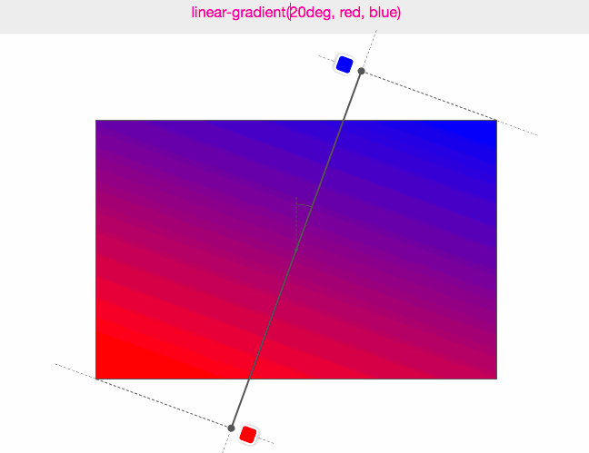

Оскільки градієнт — це фонове зображення, розглянемо техніку подвійного фону, коли над зображенням розташовується шар кольору із прозорістю.

```css
background-image: linear-gradient(
    to bottom, 
    rgba(255, 0, 0, 0.3), 
    rgba(255, 0, 0, 0.3)
    ),
    url(шлях до зображення);
```

### Властивість background

```css
background: background-color background-image background-repeat background-position background-attachment background-size
```

## Властивість box-shadow

[Shadow example](shadow.html)

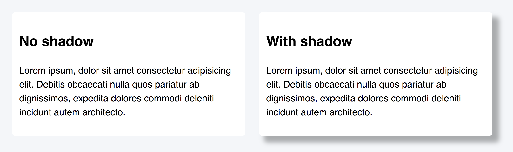

```css
box-shadow: <x-offset> <y-offset> <blur> <spread> <color>
```

- `x-offset` — горизонтальне зміщення. Позитивне значення зміщує тінь праворуч від блоку, негативне – ліворуч. Обов'язкове значення.
- `y-offset` — вертикальне зміщення. Позитивне значення зміщує тінь вниз, негативне - вгору. Обов'язкове значення.
- `blur` — радіус розмиття. Чим більше значення, тим сильніше розмита тінь. Необов'язкове значення.
- `spread` — радіус поширення. Позитивне значення збільшує тінь, негативне — зменшує. Необов'язкове значення.
- `color` — колір тіні. Можна використовувати будь-який формат запису кольору. Необов'язкове значення.

### Багатошарова тінь

```css
box-shadow: <x-offset> <y-offset> <blur> <spread> <color>,
            <x-offset> <y-offset> <blur> <spread> <color>,
            <x-offset> <y-offset> <blur> <spread> <color>,
            ...
```

### Внутрішня тінь

```css
box-shadow: inset <x-offset> <y-offset> <blur> <spread> <color>
```

## Векторна графіка

[SVG example](svg.html)

**SVG (Scalable Vector Graphics)** — формат графіки та мова для опису векторних зображень. Всередині файл не бінарний, а звичайний текст (XML), що описує об'єкти, їх ефекти та поведінку.

```css

```

```css
background-image: url("https://res.cloudinary.com/goit-academy/image/upload/v1614773221/codepen/cat_segyum.svg");
```

### Вбудований SVG

```html
    <svg class="icon" width="120" height="120" viewBox="0 0 32 32">
      <path d="M26.667 8h-5.333V5.333a2.658 2.658 0 00-2.667-2.667h-5.333a2.658 2.658 0 00-2.667 2.667V8H5.334a2.646 2.646 0 00-2.653 2.667l-.013 14.667a2.658 2.658 0 002.667 2.667h21.333a2.658 2.658 0 002.667-2.667V10.667A2.658 2.658 0 0026.668 8zm-8 0h-5.333V5.333h5.333V8z" />
```

### Властивість fill

```css
/* Встановлюємо колір заливки у спокійному стані. */
.icon {
  fill: #2a2a2a;
}

/* Змінюємо колір заливки при ховері. */
.icon:hover {
  fill: #03a9f4;
}

/* Прибрати заливку можна значенням none, в результаті чого вийде повністю прозора фігура. */
.icon {
  fill: none;
}
```

### SVG-спрайт

[icomoon.io](https://icomoon.io/) - сервіс створення svg-спрайтів.

SVG-документ — це просто текстовий файл, в якому. на відміну від растрової графіки, описані фігури, які відтворюватиме браузер. В одному файлі можна описати безліч різних груп фігур, використовуючи елемент `<symbol>`, після чого, задавши кожному символу унікальний `id`, звернутися до будь-якого з них з HTML-документа.

```svg
<svg aria-hidden="true" style="position:absolute;width:0;height:0" xmlns="<http://www.w3.org/2000/svg>" overflow="hidden">
  <defs>
    <!-- Trash can icon -->
    <symbol id="delete" viewBox="0 0 32 32">
      <path d="M8 25.333C8 26.8 9.2 28 10.667 28h10.667c1.467 0 2.667-1.2 2.667-2.667v-16h-16v16zm17.333-20h-4.667L19.333 4h-6.667l-1.333 1.333H6.666V8h18.667V5.333z" />
    </symbol>
    <!-- Camera icon -->
    <symbol id="camera" viewBox="0 0 32 32">
      <path d="M20.267 16a4.267 4.267 0 11-8.534 0 4.267 4.267 0 018.534 0z" />
      <path d="M12 2.667L9.56 5.334H5.333a2.675 2.675 0 00-2.667 2.667v16c0 1.467 1.2 2.667 2.667 2.667h21.333c1.467 0 2.667-1.2 2.667-2.667v-16c0-1.467-1.2-2.667-2.667-2.667h-4.227l-2.44-2.667h-8zm4 20c-3.68 0-6.667-2.987-6.667-6.667S12.32 9.333 16 9.333 22.667 12.32 22.667 16 19.68 22.667 16 22.667z" />
    </symbol>
    <!-- Portfolio icon -->
    <symbol id="work" viewBox="0 0 32 32">
      <path d="M26.667 8h-5.333V5.333a2.658 2.658 0 00-2.667-2.667h-5.333a2.658 2.658 0 00-2.667 2.667V8H5.334a2.646 2.646 0 00-2.653 2.667l-.013 14.667a2.658 2.658 0 002.667 2.667h21.333a2.658 2.658 0 002.667-2.667V10.667A2.658 2.658 0 0026.668 8zm-8 0h-5.333V5.333h5.333V8z" />
    </symbol>
  </defs>
</svg>
```

```html
<svg>
  <use href="./шлях-до-svg-спрайту/имэя-спрайта.svg#ідентифікатор-символа"></use>
</svg>

<svg class="icon" width="80" height="80">
    <use href="path-to-file.svg#delete"></use>
</svg>
```

## Псевдоелементи

[Pseudo-elements example](pseude.html)

### ::before ::after

```css
.box {
  /* стилі елемента */
}

.box::before {
  /* стилі псевдоелемента before */
}

.box::after {
  /* стилі псевдоелемента after */
}
```

#### content

Властивість `content` дозволяє додати текстовий контент всередину псевдоелемента. Ця властивість є **обов’язковою**, без неї браузер просто не створить псевдоелемент. Якщо за макетом текстовий контент не потрібний, його значенням необхідно поставити порожній рядок.

```css
❌ /* Некоректно оформлені загальні стилі */
.box::before::after {
  font-size: 30px;
}

/* Коректно */

.box::before {
  content: 'Цей текст у before';
  color: orange;
}

.box::after {
  content: 'Цей текст у after';
  color: teal;
}

✅ /* Коректно оформлені загальні стилі */
.box::before, .box::after {
    font-size: 30px;
}
```

### :hover

```css
/* Застосувати стилі до псевдоелементу .box::before при ховері на елемент .box */
.box:hover::before {
  background-color: green;
}

/* Застосувати стилі до псевдоелементу.box::after при ховері на елемент .box */
.box:hover::after {
  background-color: tomato;
}
```

## Позиціоновані елементи

[Position example 1](position-1.html)
[Position example 2](position-2.html)

### position

```css
position: static | relative | absolute | fixed | sticky 
```

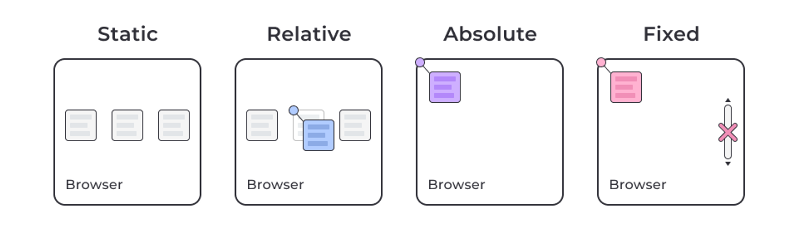

#### Відносне позиціонування

При відносному позиціонуванні елемент залишається у потоці сторінки, тобто сусідні елементи не займають його місце. Проте візуально елемент можна змістити щодо його первісного положення. При цьому він може перекривати сусідів.

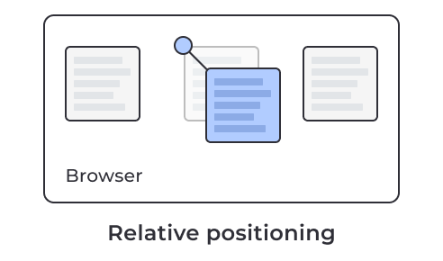

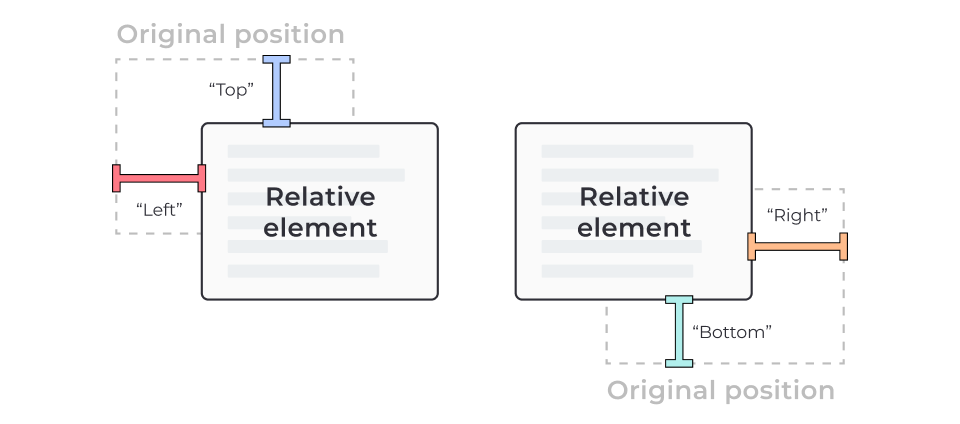

#### Абсолютне позиціонування

Абсолютне позиціонування дає зовсім інші результати порівняно з відносним.

1. При абсолютному позиціонуванні елемент вилучається з потоку сторінки, тобто сусідні елементи займають його місце.
2. За допомогою властивостей `top`, `left`, `bottom` і `right` можна налаштувати положення елемента, але треба обов’язково враховувати, звідки ведеться відлік значень цих властивостей.
3. Щоб визначити точку відліку, браузер шукає найближчий елемент-предок, у якого властивість `position` має будь-яке значення крім `static`. Якщо такого предка не виявиться, то відлік буде починатися від рамки елемента `<body>`.

Саме по собі абсолютне позиціонування не має великої користі.

Зазвичай, воно використовується у зв'язці з відносним для декоративного позиціонування елементів. Тобто елемент «абсолютно» позиціонується «відносно» якогось свого предка, який знаходиться в потоці сторінки.


У цьому випадку значення `top`, `left`, `bottom` і `right` для абсолютно позиціонованого елемента відраховуються від рамки цього предка, а не від `<body>`. Отже, `position: relative` предка ми використовуємо тільки для того, щоб абсолютно позиціонований елемент розташовувався відносно цього предка.

Запис `bottom: 20px` означає відстань між нижньою межею відносно позиціонованого предка і нижньою межею абсолютно позиціонованого елемента. Аналогічно працюють `right`, `left` і `top` — задається відстань між однойменними сторонами предка та елемента.

#### Фіксоване позиціонування

При фіксованому позиціонуванні елемент має значення `position: fixed`. Такий елемент вилучається із потоку сторінки та позиціонується відносно в'юпорту. Це створює ефект фіксації елемента у певному місці екрана під час прокручування сторінки.

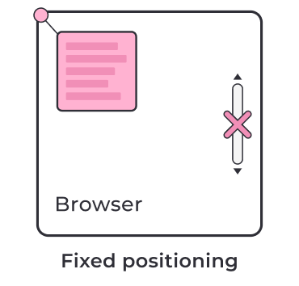

Фіксоване позиціонування використовується для закріплених хедерів з навігацією, вікон, чатів з менеджером на сторінках інтернет-магазинів, тощо.


#### Липке позиціонування

Липке позиціонування (`position: sticky`) — це комбінація властивостей `relative` і `fixed`. Подивись на гіфку, на якій липке позиціонування задається елементам з літерами A і B, так відразу стане зрозуміло.


1. Поки елемент знаходиться у своєму контейнері, і контейнер не виходить з області видимості при вертикальному прокручуванні — елемент поводиться як позиціонований відносно (relative).
2. Як тільки частина батьківського контейнера виходить із області видимості, елемент фіксується на сторінці до тих пір, поки хоча б якась частина контейнера присутня на екрані.
3. Якщо весь контейнер вийде з області видимості, то знову увімкнеться поведінка як при відносному позиціонуванні — елемент зникне з екрану за контейнером.

Для реалізації липкого позиціонування необхідні лише три умови:

- Липкому елементу необхідно задати позиціонування position: sticky.
- У липкого елемента має бути задане положення, наприклад, top: 0.
- Елемент-контейнер має бути більшим за висотою, ніж липкий елемент.

#### Властивість z-index

Властивість `z-index` контролює глибину (порядок) позиціонованих елементів на сторінці по осі `z` від очей користувача і до екрану. У якості значення може бути будь-яке ціле число, у тому числі негативне.

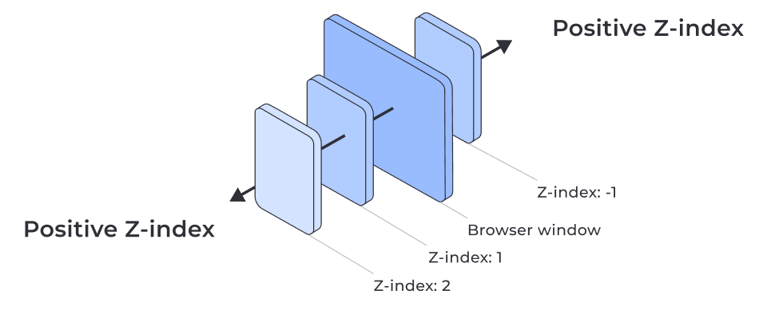

Що треба знати при використанні z-index:

1. Чим більше значення z-index всередині цього контексту, тим вище розташовується елемент.
2. Мінімальне (навіть негативне) значення z-index говорить про те, що інші елементи поза потоком будуть розташовані вище цього елементу. 
3. Якщо у двох елементів однакові значення z-index, вищим буде елемент, оголошений останнім у HTML-коді.

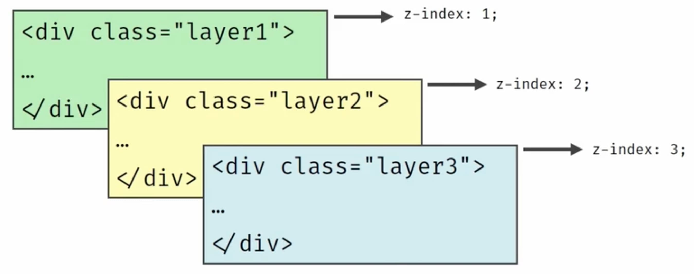

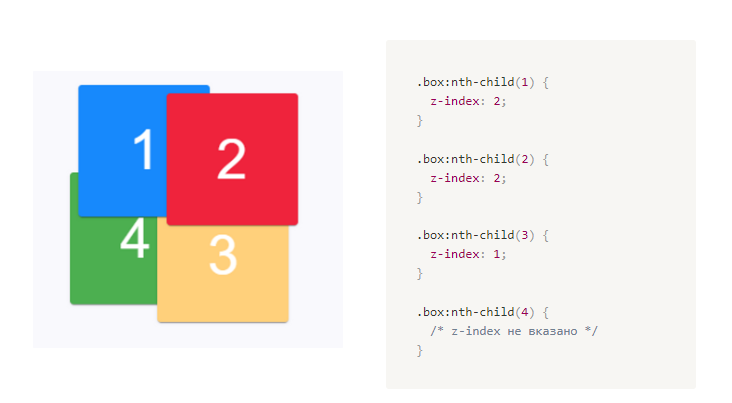

## CSS-переходи

CSS-переходи дозволяють анімувати зміну значення властивостей, задавати час та керувати швидкістю цього переходу. Зміна властивостей відбувається при певній події, наприклад: `:hover`.

Перехід завжди має тільки два стани: 1) початкове і 2) кінцеве значення властивості, і вміє змінювати це значення `A > B` і `B > A` за вказаний час.

Для анімацій, де кількість станів перевищує 2, необхідно використовувати анімацію CSS.

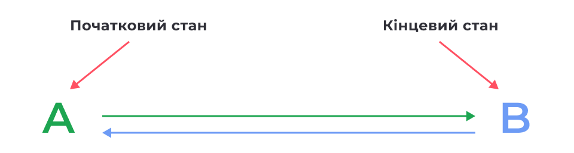

```css
transition-property: <властивість>
transition-duration: <час>
transition-timing-function: <функція розподілу часу>
transition-delay: <затримка>
```

### transition-property

Властивість `transition-property` задає властивості, до яких буде застосовано ефект переходу. Значенням може бути одна властивість або список властивостей через кому.

Значення за замовчуванням — `all`, тобто анімуються всі можливі властивості.

```css
.box {
  color: orange;
  background-color: teal;
  transition-property: color, background-color;
}

.box:hover {
  background-color: orange;
  color: white;
}
```

### transition-duration

Якщо тривалість переходу не вказана, зміна значень відбудеться миттєво, без анімації. Властивість `transition-duration` задає проміжок часу, протягом якого має здійснитися перехід.

Значення властивості вказується в:

- секундах: `2s` або `0.5s`
- мілісекундах: `2000ms` або `500ms`

```css
.box {
  background-color: teal;
  transition-property: background-color;
  transition-duration: 1000ms;
}

.box:hover {
  background-color: orange;
}
```

### transition-timing-function

Властивість `transition-timing-function` задає функцію розподілу часу, тобто поведінку анімації.

```css
.box {
  background-color: teal;
  transition-property: background-color;
  transition-duration: 1000ms;
  transition-timing-function: linear;
}

.box:hover {
  background-color: orange;
}
```

Значення властивості задається через формулу Безьє, яка описує швидкість переходу властивості від одного значення до іншого за час, зазначений в `transition-duration`,

У CSS є кілька ключових слів для опису базових функцій Безьє, що часто використовуються.

Ключові слова:

- `ease` — перехід починається повільно, швидко прискорюється, а потім знову сповільнюється в кінці.
- `linear` — перехід має рівномірну швидкість.
- `ease-in` — починається повільно, швидкість переходу збільшується до повного завершення переходу.
- `ease-out` — починається швидко, уповільнюється протягом переходу.
- `ease-in-out` — починається повільно, прискорюється, а потім знову сповільнюється.

За замовчуванням використовується значення `ease`.

### transition-delay

Властивість `transition-delay` визначає затримку, після якої розпочинається анімація переходу. За замовчуванням встановлено значення `0s`.

```css
transition-delay: значення;
```

### transition

```css
transition: [property] [duration] [timing-function] [delay]
```

Якщо анімується кілька властивостей, то набір значень кожної з них розділяється комою.

Необхідно обов'язково вказати властивість та час переходу.

Функцію часу та затримку можна не вказувати — тоді для них буде використано значення за замовчуванням.

```css
transition: background-color 500ms linear, transform 500ms ease-in-out;
```

## CSS-анімація

[Animation example](animation.html)

Проте анімація має наступні відмінності від переходів:

- не потрібен обов'язковий ініціатор (подія),
- анімацію можна повторити нескінченну кількість разів, і між початковим та кінцевим станами може бути будь-яка кількість проміжних станів.

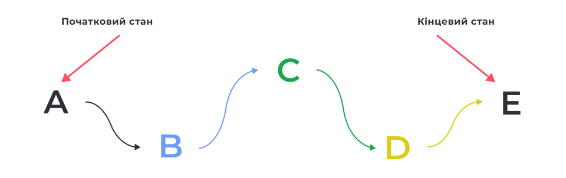

Анімація оголошується директивою `@keyframes`. Директива описує набір **кадрів** (frames, станів) анімації. В анімації має бути як мінімум два кадри: початковий і кінцевий.

```css
@keyframes changeBgColor {
  0% {
    background-color: teal;
  }

  50% {
    background-color: orange;
  }

  100% {
    background-color: deepskyblue;
  }
}
```

### animation-name

```css
.box {
  animation-name: changeBgColor;
}
```

Також можна застосувати анімацію за подією: ховер, фокус, тощо. Для цього використовуються відповідні псевдокласи.

```css
. box {
  /* Базові стилі елемента */
}

/* Додаємо анімацію за ховером */
.box:hover {
  animation-name: changeBgColor;
}
```

### animation-duration

```css
.box:hover {
  animation-name: changeBgColor;
  animation-duration: 3000ms;
}
```

За замовчуванням анімація відбувається один раз, і фінальні значення анімованих властивостей не зберігаються. Натомість елемент повертається до свого початкового стану.

### animation-timing-function

Властивість `animation-timing-function` встановлює функцію розподілу часу для анімації.

Значення є аналогічними `transition-timing-function` в CSS-переходах.

```css
.box:hover {
  animation-name: changeBgColor;
  animation-duration: 3000ms;
  animation-timing-function: linear;
}
```

### animation-iteration-count

Властивість animation-iteration-count встановлює кількість повних повторень анімації або ключовим словом `infinite` — це зробить анімацію нескінченною.

```css
.box:hover {
  animation-name: changeBgColor;
  animation-duration: 3000ms;
  animation-timing-function: linear;
  animation-iteration-count: 5;
}
```

### animation-play-state

Властивість `animation-play-state` дозволяє призупинити відтворення анімації.

За замовчуванням встановлено значення `running`.

Якщо встановити значення `paused`, наприклад, при :hover, анімацію буде призупинено, доки курсор миші знаходиться над елементом.

### animation-delay

Властивість `animation-delay` встановлює затримку початку анімації в секундах або мілісекундах, аналогічно до переходів.

```css
.box:hover {
  animation-name: changeBgColor;
  animation-duration: 3000ms;
  animation-timing-function: linear;
  animation-delay: 1s;
}
```

### animation-fill-mode

Властивість `animation-fill-mode` визначає, що відбувається зі стилями елемента до початку анімації та після її завершення. Іншими словами, ця властивість дозволяє вказати, чи мають застосовуватися стилі анімації до елемента поза анімацією.

```css
animation-fill-mode: none | forwards | backwards | both
```

- `none` — стилі анімації впливають на елемент тільки під час анімації. До та після анімації елемент знаходиться у своєму початковому стані. Це значення за замовчуванням.
- `forwards` — стилі, застосовані в кінці анімації, застосовуються до елемента після завершення анімації.
- `backwards` — початкові стилі анімації будуть застосовані до елемента ще до старту анімації.
- `both` — поєднує `forwards` і `backwards`, стилі застосовуються до та після анімації.

### animation-direction

- контролює напрямок відтворення анімації від початкового до кінцевого кадру. Або, навпаки, від кінцевого кадру до початкового.
- налаштовує, щоб порядок кадрів чергувався при кожному повторенні.

```css
.box:hover {
  animation-name: changeBgColor;
  animation-duration: 3000ms;
  animation-timing-function: linear;
  animation-iteration-count: infinite;
  animation-direction: alternate;
}
```

- `normal` — анімація відтворюється від початкового до кінцевого кадру, а потім одразу повертається до початкового кадру для наступного повторення (скидається в початковий стан). Це значення використовується за замовчуванням.
- `reverse` — анімація відтворюється у зворотному напрямку, починаючи від кінцевого кадру до початкового, а потім одразу повертається до кінцевого кадру для наступного повторення
- `alternate` — спочатку відтворення здійснюється від початкового і до кінцевого кадру, після чого відбувається зміна напрямку при кожному наступному повторенні.
- `alternate-reverse` — спочатку відтворення здійснюється від кінцевого і до початкового кадру, після чого відбувається зміна напрямку при кожному наступному повторенні.

### animation

Складова властивість animation дозволяє коротко записати властивості анімації.

```css
animation: [name] [duration] [timing-function] [delay] [iteration-count] [direction] [fill-mode] [play-state]
```

Значення необов'язкових властивостей можна пропустити або міняти місцями.

Виняток становлять властивості `duration` і `delay` — значення тривалості анімації завжди має вказуватися до затримки.

```css
.box {
  animation: magic 2s infinite;
}

.box {
  animation: magic 2s 0.5s ease-in-out;
}

.box {
  animation: magic 2s ease-in-out 0.5s forwards;
}

.box {
  animation: magic 2s forwards infinite ease-out 0.5s;
}

@keyframes magic {
  /* ... */
}
```

## 2D-трансформації

```css
transform: none | <тип трансформації> <тип трансформації> ...
```

### Масштабування

[scale example](scale.html)

Функції `scaleX(tx)`, `scaleY(ty)` і `scale(tx, ty)` масштабують блок по ширині та/або висоті, не впливаючи на геометрію навколишніх елементів. Якщо для `scale()` задано певне значення, друге буде таким самим.

```css
.box {
  transform: scale(1.15);
}
```

### Поворот

[rotate example](rotate.html)

Функція `rotate(кут)` повертає елементи на задану кількість градусів (одиниця `deg`). Позитивні значення повертають елемент за годинниковою стрілкою, негативні — проти.

```css
.box {
  transform: rotate(45deg);
}
```

Значення можна передати не лише в градусах, а й в «обертах» (одиниця `turn`). Наприклад, `rotate(0.5turn)` — це півоберту, аналог `rotate(180deg)`.

### Зміщення

[translate example](translate.html)

Функції `translateX(tx)`, `translateY(ty)` і `translate(tx, ty)` переміщають елемент у горизонтальному (вісь `X`) та/або вертикальному (вісь `Y`) напрямках щодо початкового положення.

Позитивні значення `X` зміщують елемент праворуч, негативні — ліворуч.
Позитивні значення `Y` зміщують елемент вниз, негативні — вгору.

Значення можуть бути у пікселях чи відсотках. Якщо значення задано у відсотках, воно розраховується від розміру зміщуваного елемента.

```css
.box {
  transform: translate(100px, 200px);
}
```

### Декоративний оверлей

Зміщення та властивість overflow зі значенням hidden використовуються при створенні декоративних ефектів з появою прихованого вмісту з-за меж блоку.

[overflow example](overflow.html)

### Центрування елемента

[center example](center.html)

Розглянемо прийом, що дозволяє розташувати абсолютно позиціонований елемент точно по центру блока, відносно якого він позиціонується.

```html
<div class="parent">
  <div class="box"></div>
</div>
```

```css
.parent {
  position: relative;
}

.box {
  position: absolute;
  top: 50%;
  left: 50%;
  transform: translate(-50%, -50%);
}
```

1. Абсолютно позиціонуємо елемент відносно предка.
2. Задаємо елементу властивості `top` і `left` зі значенням `50%`, щоб розташувати верхній лівий кут елемента рівно по центру предка.
3. Задаємо елементу негативне зміщення (`translate`) по `50%` висоти і ширини. Це змістить елемент вгору і вліво і відцентрує всередині предка.

### Викривлення

[skew example](skew.html)

Функції `skewX(кут)`, `skewY(кут)` і `skew(x-кут, y-кут)` використовуються для визначення параметрів викривлення (нахилу, деформування) сторін елемента відносно координатних осей. Якщо для `skew()` вказано тільки одне значення, друге буде дорівнювати 0, тобто це буде аналог `skewX()`.

