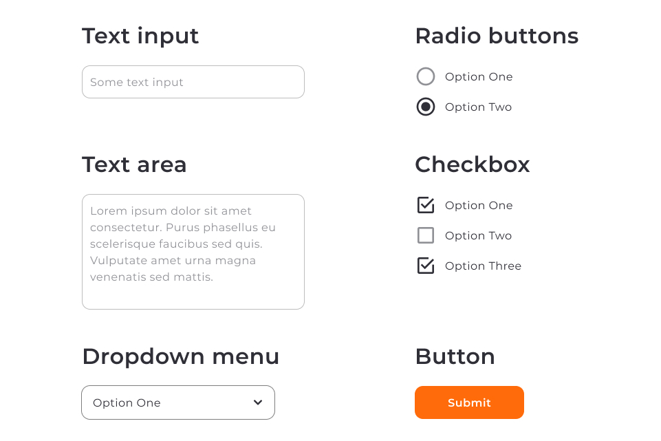
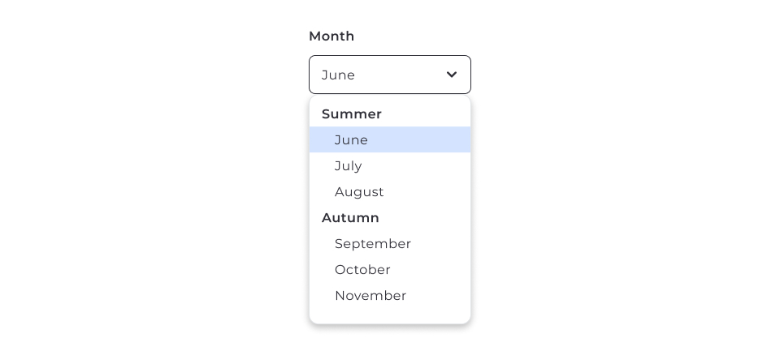
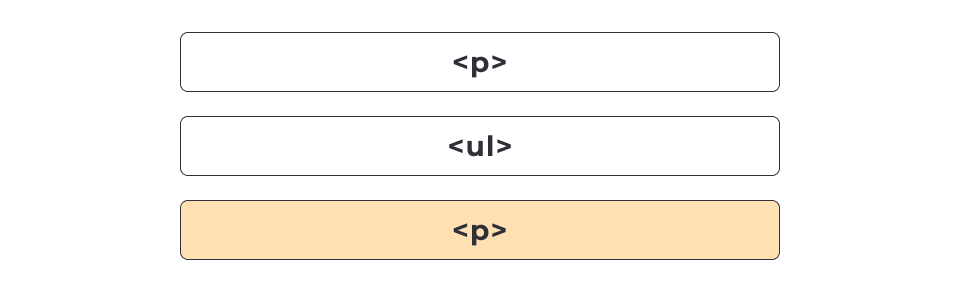
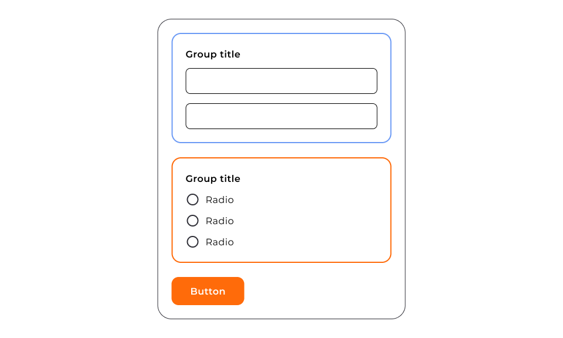

# Forms

## Елемент `form`

[Form example 1](./form-01.html)



```html
<form name="feedback_form" autocomplete="off" novalidate>
    <!-- Елементи форми -->
    <button type="submit">Submit feedback</button>
</form>
```

В елементі form немає обов'язкових атрибутів. Наведемо в прикладі кілька корисних необов'язкових

- name — ім'я форми, що є унікальним на поточній веб-сторінці. Може містити символи англійського алфавіту в будь-якому регістрі, цифри, підкреслення та тире. Не можна використовувати пробіл. Використовується як на сервері, так і на клієнті при роботі з формою.
- autocomplete — визначає, чи може браузер автоматично заповнювати значення всіх елементів форми. Має всього два значення off і on.
- novalidate — атрибут-прапор, не має значення. Говорить браузеру не перевіряти валідність введених даних під час відправки форми. Якщо атрибут не вказано, виконується вбудована у браузер валідація.

Кнопка **не успадковує** багато стилів оформлення тексту.

Основні — це сімейство шрифтів і колір тексту. Рекомендується встановити глобальний стиль тегу button. Інші властивості та їх значення варто брати з макета.

```css
button {
    font-family: inherit;
    color: currentColor;
}
```

## Елемент `input`

Елемент `input` — це універсальний елемент для створення різноманітних полів вводу. Тип поля визначається атрибутом `type`. Значення атрибуту `type` за замовчуванням: `text`. Його використання створює однорядкове текстове поле, що приймає будь-які символи.

```html
<form>
  <input type="text" name="username" minlength="5" maxlength="12" />
  <button type="submit">Submit feedback</button>
</form>
```

Атрибути `minLength` і `maxLength` не обов'язкові. Вони дозволяють обмежити кількість символів, які можна ввести в поле.

За замовчуванням поле введення є рядковим елементом, який не успадковує сімейство шрифтів. Отже, до глобальних стилів можна додати правило для всіх полів вводу.

```css
input {
    font-family: inherit;
}
```

### input types

Значення атрибута type визначає тип поля і набір символів, які в нього можна ввести.

- `email` - Коли браузер смартфона бачить поле з типом "email", він відображає користувачеві спеціальну клавіатуру для введення електронної пошти з легко доступним символом @. Браузер також може надати спосіб вибрати адресу пошти з адресної книги.

    ```html
    <input type="email" name="email" />
    ```

- `password` - значення пароля, який вводить користувач, буде візуально замінено на маркери з міркувань безпеки

    ```html
    <input type="password" name="pwd" />
    ```

- `tel` - відображенні віртуальної клавіатури для введення телефонних номерів у мобільних браузерах, що містить цифри, але не літери

    ```html
    <input type="tel" name="phone" />
    ```

- `number` - введенні даних у числове поле браузер ігнорує все, окрім цифр

    ```html
    <input type="number" name="age" value="0"  min="18" max="120" step="0.5" />
    ```

    За замовчуванням числові поля приймають лише цілі числа. Цю поведінку можна змінити за допомогою атрибута step. Цей атрибут вказує крок зміни числа. За замовчуванням значення кроку дорівнює 1.

- `date`, `time` або `datetime-local`

    ```html
    <!-- Для вибору лише дати -->
    <input type="date" />
    <!-- Для вибору лише часу-->
    <input type="time" />
    <!-- Для вибору дати і часу -->
    <input type="datetime-local" />
    ```

- `radio` - перетворює поле вводу на перемикач (радіокнопку, radio button)

    

    ```html
    <form>
    <p>Choose a color:</p>
    <label>
        <input type="radio" name="color" value="red" checked />
        Red
    </label>
    <label>
        <input type="radio" name="color" value="white" />
        White
    </label>
    <label>
        <input type="radio" name="color" value="green" />
        Green
    </label>
    </form>
    ```

- `checkbox` - Прапорці (чекбокси, checkbox) схожі на перемикачі, але дозволяють вибирати довільну кількість значень, тобто багато з багатьох.

    ```html
    <form>
    <p>What are your hobbies?</p>
    <label>
        <input type="checkbox" name="hobby" value="music" checked />
        Music
    </label>
    <label>
        <input type="checkbox" name="hobby" value="sports" checked />
        Sports
    </label>
    <label>
        <input type="checkbox" name="hobby" value="reading" />
        Reading
    </label>
    </form>
    ```

### Псевдоклас `:checked`

Псевдоклас :checked застосовується до: радіокнопок, чекбоксів, опцій випадаючого меню в селектах.

Він дозволяє додати стилі тільки до зазначених полів (інтерактивів).

```css
input:checked {
    box-shadow: 0 0 0 2px orangered;
}
```

## Елемент `label`

Якщо елемент форми вкладається в `label`, зв'язок створюється браузером автоматично. Клік за текстом «Username» поставить фокус у поле введення

```html
<form>
  <label>
    Username
    <input type="text" name="username" />
  </label>
  <button type="submit">Submit feedback</button>
</form>
```

Якщо елемент форми не вкладено в `label`, необхідно явно зв'язати їх через:

- атрибут `id` елемента та
- атрибут `for` мітки

```html
<form>
  <label for="username">Username</label>
  <input type="text" name="username" id="username" />
  <button type="submit">Submit feedback</button>
</form>
```

## Атрибут `placeholder`

**Атрибут** `placeholder` дозволяє відображати текст-підказку про дані, які необхідно ввести в поле. Текст-підказка відображається, коли елемент input пустий та зникає при введенні тексту від користувача.

```html
<form>
  <label>
    Username
    <input type="text" name="username" placeholder="Jacob Mercer" />
  </label>
  <button type="submit">Submit feedback</button>
</form>
```

## Псевдоелемент `::placeholder`

Для оформлення тексту підказки використовується псевдоелемент `::placeholder`.

```css
input::placeholder {
    color: teal;
    font-weight: 700;
}

input:hover::placeholder, 
input:focus::placeholder {
  color:orange;
}
```

## Псевдоклас `:placeholder-shown`

Псевдоклас `:placeholder-shown` застосовується залежно від видимості тексту-підказки та значення атрибута `placeholder`.

```css
input {
  border: 1px solid orange;
}

input:placeholder-shown {
  border-color: blue;
}
```

## Атрибут `autofocus`

За наявності цього атрибута, поле вводу автоматично отримує фокус при завантаженні. Отже, в ньому відразу можна буде набирати текст. За замовчуванням цього атрибута немає в жодному полі.

```html
<form>
  <label>
    First name
    <input type="text" name="firstName" autofocus />
  </label>
  <label>
    Last name
    <input type="text" name="lastName" />
  </label>
  <button type="submit">Submit</button>
</form>
```

## Псевдоклас `:focus-within`

Застосовується до елемента, щойно він сам або елементи всередині нього отримують фокус. Це дозволяє застосувати стилі на: мітку, форму, окреме поле форми при взаємодії користувача з полями форми.

```css
form:focus-within {
    border-color: blue;
}
```

## Елемент `textarea`

Парний тег, який створює багаторядкове поле для вводу великої кількості тексту. 

```html
<textarea name="" rows="" cols="" placeholder=""></textarea>
```

`textarea` має такі атрибути:

- `rows` — встановлює кількість рядків (висоту)
- `cols` — встановлює кількість колонок (ширину)

За замовчуванням елемент `textarea` можна розтягувати по горизонталі і вертикалі. Для того щоб контролювати можливість зміни розміру користувачем, CSS має властивість `resize`.

```css
    resize: both | horizontal | vertical | none
```

## Елемент `select`

Елемент `select` — це випадаюче меню (або, як його ще називають, комбобокс), що дозволяє вибрати одну з декількох опцій (варіантів відповідей).


```html
<select name="size">
  <option value="xs">Extra Small</option>
  <option value="s">Small</option>
  <option value="m" selected>Medium</option>
  <option value="l">Large</option>
</select>
```



```html
<select name="month">
  <optgroup label="Summer">
    <option value="s6">June</option>
    <option value="s7">July</option>
    <option value="s8">August</option>
  </optgroup>

  <optgroup label="Autumn">
    <option value="s9">September</option>
    <option value="s10">October</option>
    <option value="s11">November</option>
  </optgroup>
</select>
```

## Селектор атрибута

Селектор `input:checked` застосовується до всіх можливих полів.

Для того щоб стилізувати тільки чек-бокси форми, але не задавати клас кожному полю вводу, можна використовувати селектор атрибута.

```css
input[type="checkbox"] {
}
```

Загальна структура селектора атрибута — це селектор → ім'я атрибута → значення атрибута.

```css
selector[attribute_name="..."]
```

```css
input[type="checkbox"]:checked {
    box-shadow: 0 0 0 2px orangered;
}
```

## Селектор X + Y

Цей селектор вибирає тільки той елемент `Y`, який в HTML-розмітці слідує відразу ж за `X`.

```css
ul + p {
    background-color: yellow;
}
```

У цьому CSS правилі ми виберемо тільки той абзац тексту, що розташований після ненумерованого списка



Поєднуючи селектор `X + Y` та псевдокдас `:checked`, можна зробити так, щоб при виборі чек-боксу текст мітки вибраного змінював колір.

```html
<input type="checkbox" name="hobby" value="music" id="music" checked/>
<label for="music">Music</label>
```

```css
.form-input:checked + .form-label {
    color: #2196f3;
}
```


## Атрибут `required`

Логічний атрибут `required` позначає поле форми як обов'язкове для заповнення. Під час надсилання форми браузер виведе повідомлення підказку, якщо поле порожнє. Зовнішній вигляд повідомлення залежить від браузера і не може бути змінений із CSS.

```html
<input type="email" name="email" required />
```

Щоб зробити групу радіокнопок або чекбоксів обов'язковою, необхідно задати атрибут `required` кожному елементу групи.

```html
<input type="checkbox" name="hobby" value="sports" required />
<input type="checkbox" name="hobby" value="music" required />
<input type="checkbox" name="hobby" value="books" required />
```

## Атрибут disabled

Атрибут `disabled` дозволяє зробити інтерактивний елемент неактивним. Такі елементи не отримують ефекту фокусу, а також ігнорують кліки миші.

```html
<button type="button">Active button</button>
<button type="button" disabled>Disabled button</button>
```

```css
button:disabled {
  background-color: lightgray;
  cursor: not-allowed;
}
```

## Елемент `fieldset`

Елемент `fieldset` — це контейнер для групування декількох пов'язаних елементів у формі, а вкладений legend виконує роль заголовка групи. Пов'язані радіокнопки та чек-бокси завжди повинні бути згруповані. Інші типи полів групуються за потребою.



```html
<form>
  <fieldset>
    <legend>Заголовок групи</legend>
    <!-- Група інтерактивних елементів -->
  </fieldset>

  <fieldset>
    <legend>Заголовок групи</legend>
    <!-- Група інтерактивних елементів -->
  </fieldset>

  <button type="submit">Submit</button>
</form>
```

За замовчуванням елемент `fieldset` має маржини, падінги і рамку. Їх можна скинути глобально або точково для певної форми, залежить від завдання.

```css
fieldset {
  padding: 0;
  margin: 0;
  border: none;
}
```
