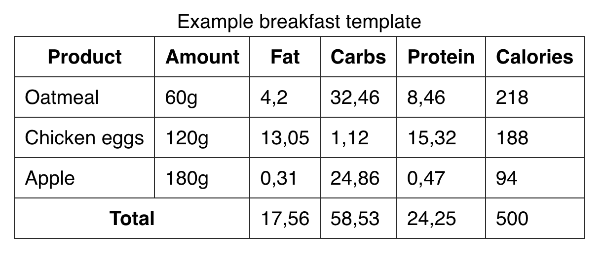

# Tables

**Таблиця** — це інформація, подана у двовимірному вигляді, що складається з рядків та стовпців. Табличні дані містяться у клітинках.



## Базові теги

- `<table>` — визначає таблицю цілком, тег-контейнер для всього вмісту. Він показує де таблиця починається і де закінчується.
- `<tr>` — рядок таблиці (`table row`). Не може бути порожнім, повинен містити хоча б одну клітинку.
- `<td>` — клітинка таблиці (`table data`). Можна використовувати лише всередині рядка. У кожному рядку таблиці має бути однакова кількість клітинок.
- `<th>` (table header) — спеціальний семантичний тег клітинки-заголовка. За замовчуванням текст усередині `<th>` виділяється жирним шрифтом та центрується.

## Клітинки-заголовки. Заголовок рядка

Це нормально, у рядку з підсумками можна змішувати клітинки-заголовки ('<th>') та просто клітинки з даними ('<td>'). У такому випадку зазвичай заголовок рядка йде першим, після чого йдуть клітинки з даними.

```html
<table>
    <!-- Розмітка рядків заголовків -->

    <!-- Розмітка рядків з даними -->

  <tr>
    <th>Total</th>
    <td></td>
    <td>17,56</td>
    <td>58,53</td>
    <td>24,25</td>
    <td>500</td>
  </tr>
</table>
```

## Атрибут `scope`

Для уточнення типу клітинки-заголовка (заголовок стовпця або заголовок рядка) використовується атрибут `scope="значення"` (область дії):

- значення атрибуту `col` вкаже, що це заголовок стовпця;
- значення атрибуту `row` вкаже, що це заголовок рядка.

```html
<table>
  <tr>
    <th scope="col">Product</th>
    <th scope="col">Amount</th>
    <th scope="col">Fat</th>
    <th scope="col">Carbs</th>
    <th scope="col">Protein</th>
    <th scope="col">Calories</th>
  </tr>

    <!-- Розмітка рядків з даними -->

  <tr>
    <th scope="row">Total</th>
    <td></td>
    <td>17,56</td>
    <td>58,53</td>
    <td>24,25</td>
    <td>500</td>
  </tr>
</table>
```

Так само, якщо клітинка містить групу рядків, тобто значення `rowgroup` і для групи стовпців `colgroup`.

*Цей атрибут не має жодного візуального ефекту в браузері, але використовується програмами читання з екрана та пошуковими системами.*

## Розділи таблиці

Для групування вмісту таблиці та підвищення семантики HTML-розмітки є кілька структурних тегів

- `<thead>` — хедер таблиці огортає групу рядків таблиці в області заголовка.
- `<tbody>` — тіло таблиці огортає основну групу рядків таблиці з даними.
- `<tfoot>` — футер таблиці, позначає групу рядків з підсумками (все, що йде після рядків з даними).

```html
<table>
  <thead>
    <tr>
      <th scope="col">Product</th>
      ...
    </tr>
  </thead>

  <tbody>
    <tr>
      <td>Oatmeal</td>
      ...
    </tr>
    ...
  </tbody>

  <tfoot>
    <tr>
      <th scope="row">Total</th>
      ...
    </tr>
  </tfoot>
</table>
```

*Елементи `<thead>`, `<tbody>` і `<tfoot>` не впливають на візуальне відображення таблиці та не є обов'язковими. За винятком того, що `<tbody>` є обов'язковим, якщо є `<thead>` або `<tfoot>`. Також їх використання полегшує майбутню стилізацію елементів таблиці.*

## Заголовок таблиці

Більш семантично буде використати спеціальний табличний тег `<caption>`. Цей тег розташовується всередині таблиці, першим елементом.

```html
<table>
  <caption>
    Example breakfast template
  </caption>

  <!-- Розмітка таблиці -->
</table>
```

## Угруповання клітинок

### атрибут `colspan`

Значення `colspan` — це число клітинок праворуч, що вимагають об'єднання.

```html
<th scope="row" colspan="2">Total</th>
```

### атрибут `rowspan`

Значення атрибуту `rowspan` дорівнює кількості клітинок, що вимагають об'єднання знизу.

```html
<th rowspan="2">Cloud service</th>
```


