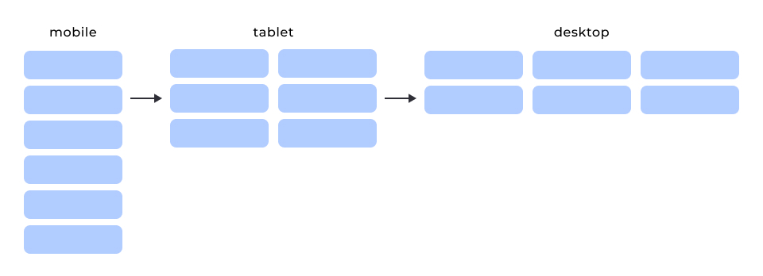
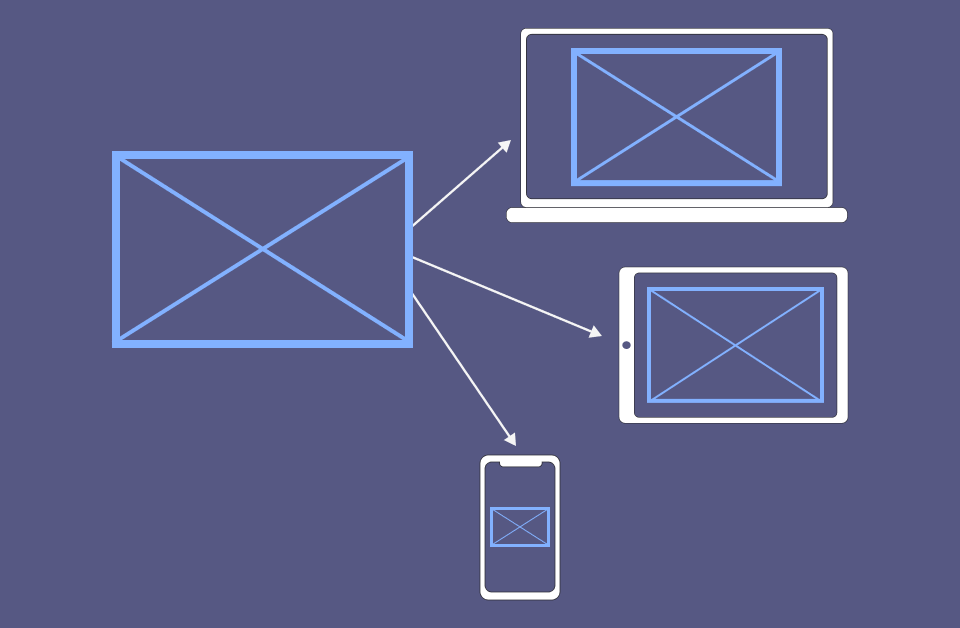

# Адаптивна сітка



Використаємо наступну HTML-розмітку та розмістимо `div.element` всередині `div.container` згідно з ілюстрацією (макетом) з двома точками перелому `768px` та `1024px`.

```html
<div class="container">
  <div class="element">1</div>
  <div class="element">2</div>
  <div class="element">3</div>
  <div class="element">4</div>
  <div class="element">5</div>
  <div class="element">6</div>
</div>
```

## Базові стилі

Запишемо базові стилі та стилі для мобільних пристроїв, тобто без медіазапиту.

Стилів елемента, пов'язаних саме з позиціонуванням, немає. Є тільки стилі контейнера для налаштування його ширини, центрування і встановлення зазору між елементами.

```css
.container {
  display: flex;
  flex-direction: column;
  gap: 5px;
  max-width: 1170px;
  min-width: 320px;
  maring: 0 auto;
}
```

## Перша точка перелому

У першій точці перелому `768px` необхідно поставити елементи горизонтально так, щоб вони поміщалися по два рядки. Для цього змінюємо напрямок головної осі і робимо контейнер багаторядковим. Для елементів задаємо розмір за знайомою вже нам формулою з техніки створення сіток.

```css
@media (min-width: 768px) {
  .container {
    flex-direction: row;
    flex-wrap: wrap;
    gap: 10px;
  }

  .element {
    flex-basis: calc((100% - 10px) / 2);
  }
}
```

### Друга точка перелому

Останнім кроком буде зміна зазору, кількості та розміру елементів для точки перелому `1024px` згідно з макетом.

```css
@media screen and (min-width: 1024px) {
  .container {
    gap: 15px;
  }

  .element {
    flex-basis: calc((100% - 30px) / 3);
  }
}
```

## Гумові зображення

це термін для опису набору прийомів, використовуваних в HTML і CSS, за допомогою яких контентні і фонові зображення виглядають однаково добре на пристроях з різними розмірами і щільністю екрана.

Найпростіший спосіб реалізувати респонсивність — це зробити зображення гумовим, тобто використовувати одне зображення для всіх пристроїв і глобально задати набір CSS-властивостей (див. код нижче).

```css
img {
  display: block;
  max-width: 100%;
}
```



```html
<div class="thumb">
  
</div>
```

```css
.thumb {
  max-width: 960px;
  min-width: 320px;
  margin: 0 auto;
}

img {
  display: block;
  max-width: 100%;
}
```

## Респонсивні зображення

Щоб браузер міг завантажити різні зображення:

- розробник вказує список доступних до завантаження зображень
- браузер вибирає те зображення, що відповідає піксельній щільності екрана


```html

```

## Фонові зображення

Растрові фонові зображення також необхідно підготувати для екранів підвищеної щільності. Для ретинізації фонового зображення необхідно встановити розмір фону елемента рівним розміру самого елемента.

```css
.box {
  width: 200px;
  height: 300px;
  background-image: url('photo.png');
  background-size: 200px 300px;
  /* background-size: cover; */
}
```

На якість відображення фону також впливає щільність пікселів екрана.

Щоб визначити щільність пікселів екрана CSS, є медіафункції: `resolution`, `min-resolution` і `max-resolution`. Вони дозволяють перевірити точний збіг і мінімальне/максимальне значення щільності пікселів пристрою.

```css
/* Базові стилі і 1x зображення */
.box {
  width: 200px;
  height: 300px;
  background-image: url('photo.png');
  background-size: 200px 300px;
}

/* Перевизначаємо шлях до зображення
   якщо щільність екрана як мінімум 2x */
@media (min-resolution: 192dpi) {
  .box {
    background-image: url('photo@2x.png');
  }
}
/* OR */
@media (min-resolution: 2x) {
  .box {
    background-image: url('photo@2x.png');
  }
}
```

На екранах стандартної щільності 96dpi. Тому для перевірки екранів із щільністю 2 і більше вказуємо значення 192dpi (96x2).

```css
/* 1x screens, default value, 320x240 image */
.box {
  margin: 0 auto;
  width: 320px;
  height: 240px;
  background-image: url("https://picsum.photos/id/237/320/240");
  background-size: 320px 240px;
}

/* 2x screens, retina, 640x480 image */
@media (min-resolution: 2x) {
  .box {
    background-image: url("https://picsum.photos/id/237/640/480");
  }
}
```
