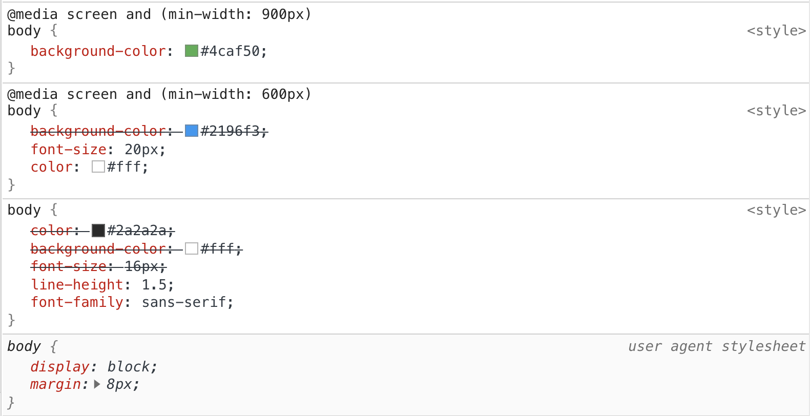

# @madia

```html
<head>
  <!-- Інші мета-теги -->
  <meta name="viewport" content="width=device-width, initial-scale=1.0" />
  <title>Мета-тег viewport важливий для адаптивних сторінок</title>
</head>
```

```css
@media media-type and (media-feature) {
  /*
  * Набір CSS-правил, які потрібно застосувати,
  * якщо умова перевірки медіатипу та функції істинна
  */
}
```

```css
@media screen and (min-width: 900px) {
  body {
    background-color: orange;
  }
}
```

## Функція min-width

Функція min-width визначає мінімальну ширину області перегляду. У разі, якщо екран відповідає значенню в min-width, будуть застосовані вкладені CSS-правила.

```css
/* CSS-правила нижче застосовуються, коли ширина в'юпорта більше або дорівнює 800px */
@media (min-width: 800px) {
  body {
    background-color: orange;
  }
}
```

## Функція max-width

Медіафункція max-width визначає максимальну ширину в'юпорта, до якої включно будуть застосовуватися вкладені CSS-правила.

```css
/* CSS-правила застосовуються, коли ширина в'юпорта менше або дорівнює 600px */
@media (max-width: 600px) {
  body {
    background-color: green;
  }
}
```

## Численні медіазапити

```css
body {
  background-color: white;
}

/* Застосовується коли ширина в'юпорта менше або дорівнює 600px */
@media (max-width: 600px) {
  body {
    background-color: green;
  }
}

/* Застосовується коли ширина в'юпорта більше або дорівнює 800px */
@media (min-width: 800px) {
  body {
    background-color: orange;
  }
}
```

## Перевизначення властивостей

Перевизначаються лише однакові властивості, а не все правило цілком.

Завдяки цьому можна робити листковий пиріг зі стилів, не дублюючи попередні, які підходять і для поточного медіазапиту.

```css
/* Базові стилі */
body {
  color: #2a2a2a;
  background-color: #fff;
  font-size: 16px;
  line-height: 1.5;
  font-family: sans-serif;
}

/* Від 600px і більше, змінимо колір фону, розмір та колір тексту */
@media (min-width: 600px) {
  body {
    background-color: #2196f3;
    font-size: 20px;
    color: #fff;
  }
}

/* Від 900px і більше змінимо колір фону. */
@media (min-width: 900px) {
  body {
    background-color: #4caf50;
  }
}
```



## Медіа-типи

Медіатип використовується для опису типу пристроїв, на яких може відображатися веб-сторінка. Взагалі є три типи, які підтримуються всіма сучасними браузерами.

Значення `print` дозволяє визначити стилі, що будуть застосовані при відправці на друк. Друк може виконуватися на фізичному принтері або віртуально. В останньому випадку маються на увазі пристрої, що призначені для відтворення друкованого варіанта, наприклад веб-браузер, який відображає документ у режимі «Попередній перегляд».

```css
@media print {
  body {
    color: green;
  }
}
```

Значення `screen` визначає стилі, що будуть застосовані тільки для пристроїв з фізичним екраном: смартфони, планшети, монітори, телевізори тощо. Тобто все, що не охоплює тип `print`. Значення `screen` використовується дуже часто, оскільки багато типів носіїв інформації — це пристрої з екранами.

```css
@media screen and (min-width: 400px) {
  /* ... */
}
```

Якщо не вказати тип носія, за замовчуванням буде використано значення `all`. Воно означає будь-який пристрій.

```css
@media (min-width: 400px) {
  /* ... */
}
```

## Логічні оператори

```css
@media only|not media-type ****only|and|not ****(media-feature) {
  /*
    Набір CSS-правил, які потрібно застосувати до документа,
    якщо умова перевірки медіатипу та виразу істинна
  */
}
```

### Оператор `and`

```css
@media screen and (min-width: 400px) and (max-width: 800px) {
  body {
    background-color: red;
  }
}
```

Такий медіазапит виконається тільки при виконанні двох умов:

- Веб-сторінка відкрита на екрані.
- Ширина області перегляду знаходиться в діапазоні від 400px до 800px.

### Оператор `or`

Логічний оператор or у коді записується у вигляді коми (`,`).

```css
@media screen and (max-width: 600px), (min-width: 900px) {
  body {
    background-color: orange;
  }
}
```

### Оператор `not`

Оператор `not` (буквально «НЕ») дозволяє зробити заперечення, тобто скасувати медіазапит. Ключове слово `not` додається на початок медіазапиту і застосовується до всього запиту цілком. Використовується вкрай рідко.

Запишемо умову, за якої стилі повинні застосовуватися скрізь, окрім друку.

```css
@media not print {
  /* ... */
}
```

При використанні оператора not обов'язково повинен бути вказаний тип носія.

Якщо не вказати тип носія, тоді за замовчуванням для нього буде встановлено значення `all`. Таким чином, з’явиться вираз `not all`, який читатиметься буквально як «не застосовувати для всіх носіїв», і **медіазапит не виконається ніколи**.

```css
/* Ніколи не виконується */
@media not (max-width: 500px) {
  /* ... */
}
```

Наступний медіазапит виконається, тільки якщо сторінка буде відкрита на пристрої з екраном, а **ширина перегляду буде більше** `500px`.

```css
@media not screen and (max-width: 500px) {
  body {
    background-color: tomato;
  }
}
```

! Зверни увагу! У прикладі, наведеному вище, логічний оператор not застосовується до обох умов у виразі `screen and (max-width: 500px)`. Це особливість синтаксису, про яку треба пам’ятати.

У такому випадку для простоти читання коду, замість заперечення та `max-width`, краще просто використовувати `min-width`.

```css
@media (min-width: 500px) {
  body {
    background-color: tomato;
  }
}
```
